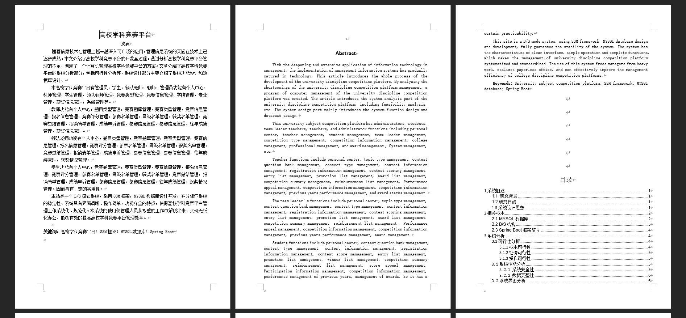
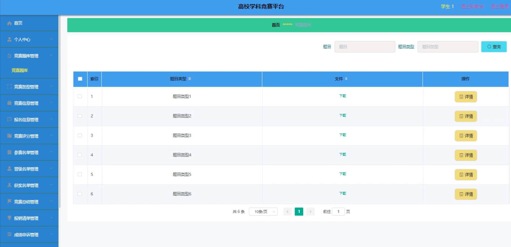
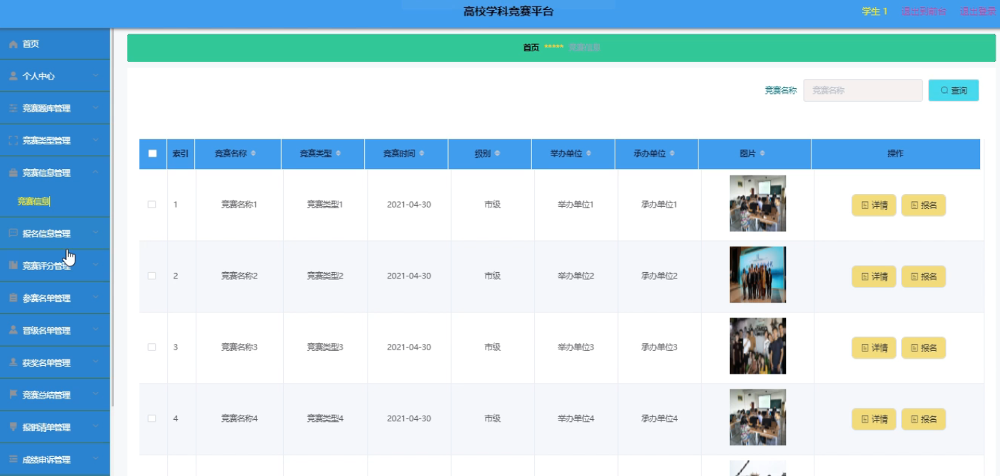
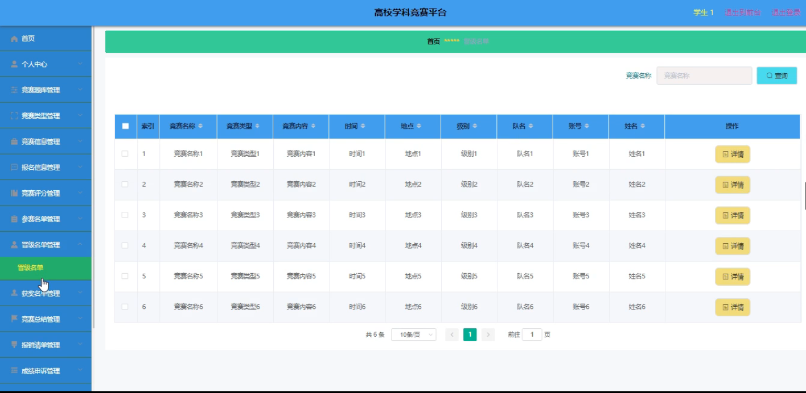
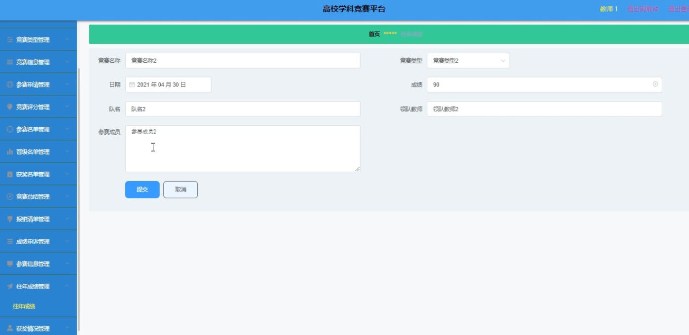
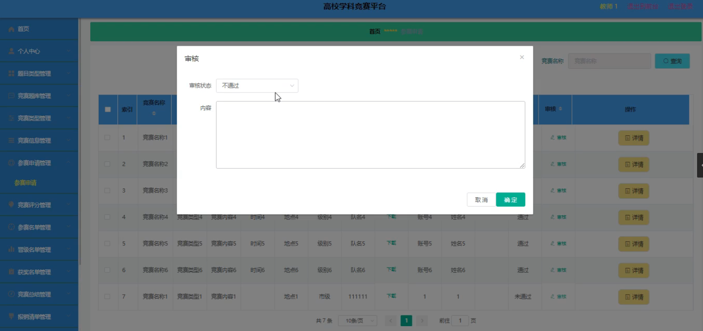

基于Springboot的高校学科竞赛平台（程序+论文）
=
### 完整代码获取地址：从戎源码网 ([https://armycodes.com/](https://armycodes.com/))
### 作者微信：19941326836  QQ：952045282 
### 承接计算机毕业设计、Java毕业设计、Python毕业设计、深度学习、机器学习
### 选题+开题报告+任务书+程序定制+安装调试+论文+答辩ppt 一条龙服务
### 所有选题地址https://github.com/nature924/allProject

一、项目介绍
---
系统包含两种角色：用户、管理员，系统分为前台和后台两大模块，主要功能如下：
### 1 竞赛题库管理
- 竞赛题库管理: 系统管理员可以对竞赛题库进行全面管理，包括添加、修改、删除及查询竞赛题库信息。

### 2 竞赛信息管理
- 竞赛信息管理: 系统管理员可以查看和管理竞赛信息，包括添加、修改、删除及查询操作。

### 3 晋级名单管理
- 晋级名单管理: 管理员可以对晋级名单进行修改、删除和查询操作，以确保晋级信息的准确性。

### 4 往年成绩管理
- 往年成绩管理: 教师可以对往年竞赛成绩进行修改和查询，确保成绩数据的更新和准确。

### 5 参赛申请管理
- 参赛申请管理: 教师可以审核学生提交的参赛申请，以确认其参赛资格和信息。

二、项目技术
---
- 编程语言：Java
- 数据库：MySQL
- 项目管理工具：Maven
- 前端技术：VUE、HTML、Jquery、Bootstrap
- 后端技术：Spring、SpringMVC、MyBatis

三、运行环境
---
- 操作系统：Windows、macOS都可以
- JDK版本：JDK1.8以上都可以
- 开发工具：IDEA、Ecplise、Myecplise都可以
- 数据库: MySQL5.7以上都可以
- Tomcat：任意版本都可以
- Maven：任意版本都可以

四、运行截图
---
### 论文截图：

### 程序截图：

